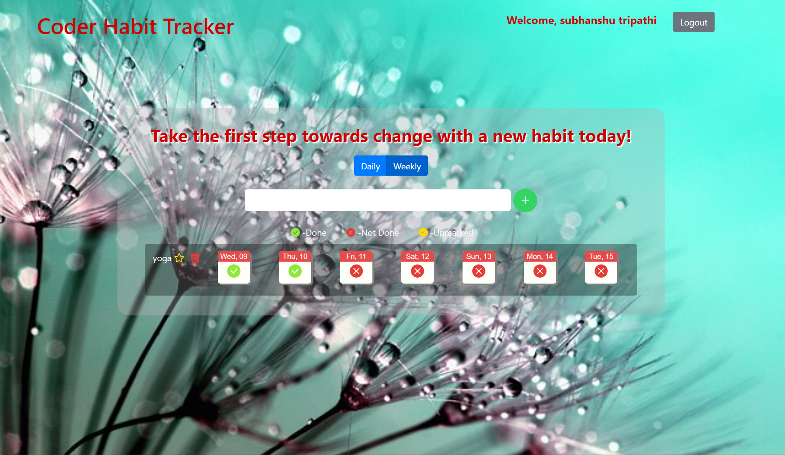

# Coder Habit Tracker App
> The habit tracker app allows users to add and track multiple habits daily. It displays the status of each habit for the last 7 days and allows users to toggle between the three statuses (done, not done, none). All habit data is stored in a database for easy retrieval, and the app can also track the user's longest streak and total completion days. Overall, the app is a useful tool for developing positive habits and staying motivated.

## Features 
- Add multiple habits to track.
- Track each habit every day.
- View all current habits.
- Display 7 days of each habit.
- Toggle between the three statuses.
- Store data in a database.

## Technologies Used
1.  NodeJS
2.  Express
3.  MongoDB
4.  EJS

### 📚 Libraries:
- connect-flash
- express-ejs-layout
- ejs
- mongoose
- express-session
- cookie-parser
- connect-mongo
- dotenv
- express

## Installation

##### Install NPM dependencies

`npm install`

##### Start your app

`npm start`

#### The Server should now be running at http://localhost:8000/

## Folder Structure
📦coder-habit-tracker
┣ 📂DEMO ----> Some screenshoots of project
┣ 📂assets
┃ ┗ 📂css
┃ ┃ ┣ 📜habit.jpg
┃ ┃ ┗ 📜styles.css
┣ 📂config
┃ ┗ 📜mongoose.js
┣ 📂controllers
┃ ┣ 📜dashboard_controller.js
┃ ┣ 📜home_controller.js
┃ ┣ 📜updateHabitStatus_controller.js
┃ ┗ 📜user_controller.js
┣ 📂models
┃ ┣ 📜Habit.js
┃ ┗ 📜User.js
┣ 📂routes
┃ ┣ 📜index.js
┃ ┗ 📜users.js
┣ 📂views
┃ ┣ 📂partials
┃ ┃ ┗ 📜messages.ejs
┃ ┣ 📜dashboard.ejs
┃ ┣ 📜home.ejs
┃ ┣ 📜layout.ejs
┃ ┣ 📜login.ejs
┃ ┗ 📜register.ejs
┣ 📜.env
┣ 📜.gitignore
┣ 📜app.js
┣ 📜package-lock.json
┣ 📜package.json
┗ 📜README.md

## Credits
This project was developed by Subhanshu tripathi as a coding exercise. It is not intended for production use.

## License
This project is licensed under the MIT License. Feel free to use and modify the code as you see fit.

